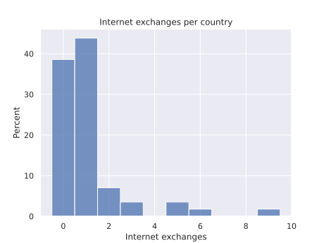

Working on a choropleth of IP transit costs ($/Gbps) in African countries.

TODO: investigation of internet exchanges throughout africa

- Histogram of internet exchanges per country

TODO: map

## Sources

- [Internet Exchange Map](https://www.internetexchangemap.com/#/) by TeleGeography
- [Packet Clearing House](https://www.pch.net/)

## References

- [Python Graph Gallery on choropleths](https://www.python-graph-gallery.com/choropleth-map-plotly-python)